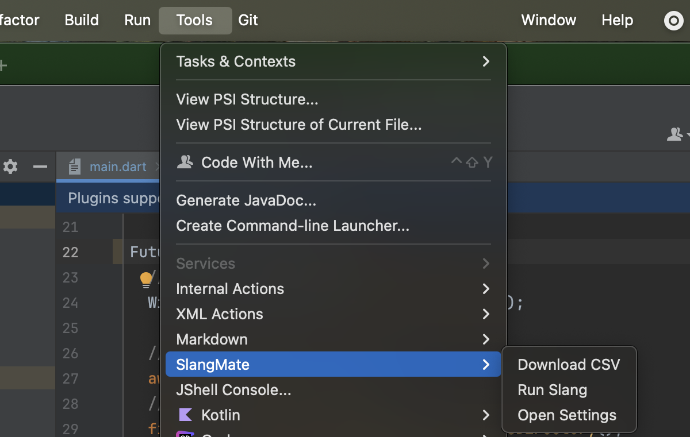

# SlangMate

[English](../README.md) | [日本語](README_ja.md) | [한국어](README_ko.md) | [简体中文](README_zh-CN.md) | [繁體中文](README_zh-TW.md) | [Tiếng Việt](README_vi.md) | [ไทย](README_th.md) | [Español](README_es.md) | [Italiano](README_it.md) | [नेपाली](README_ne.md) | [فارسی](README_fa.md) | [हिन्दी](README_hi.md)

SlangMate 是一個用於管理 Flutter 本地化的 IntelliJ IDEA / Android Studio 外掛程式，使用 slang。

## 功能

- 從 Google Sheets 下載 CSV 翻譯資料
- 一鍵執行 `fvm flutter pub run slang`
- 自訂 Google Sheets ID 和儲存路徑
- 支援 fvm (Flutter Version Management)

## 截圖

## 安裝

從 JetBrains Marketplace 安裝：
[https://plugins.jetbrains.com/plugin/26502-slangmate/](https://plugins.jetbrains.com/plugin/26502-slangmate/)

## 使用方法

1. 開啟 `設定 → CSV 下載設定` 並輸入 Google Sheets ID
2. 從 `工具` 選單執行 "SlangMate - 下載 CSV" 以儲存檔案
3. 從 `工具` 選單執行 "SlangMate - 執行 slang" 以產生本地化程式碼

## 支援的語言

- 🇺🇸 English
- 🇯🇵 日本語 (Japanese)
- 🇰🇷 한국어 (Korean)
- 🇨🇳 简体中文 (Simplified Chinese)
- 🇹🇼 繁體中文 (Traditional Chinese)
- 🇻🇳 Tiếng Việt (Vietnamese)
- 🇹🇭 ไทย (Thai)
- 🇪🇸 Español (Spanish)
- 🇮🇹 Italiano (Italian)
- 🇳🇵 नेपाली (Nepali)
- 🇮🇷 فارسی (Persian)
- 🇮🇳 हिन्दी (Hindi)

## 授權條款

[Apache License 2.0](../LICENSE) 